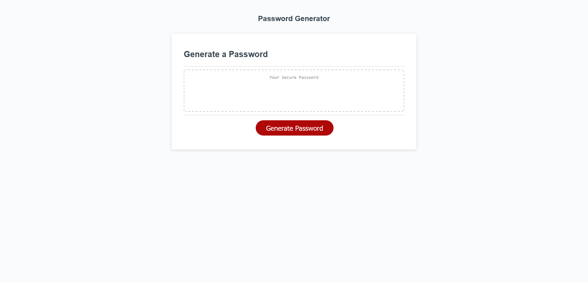

# Password Generator

[Link to the deployed application.](https://karlnh.github.io/studious-journey/)

## Description

This project lets a user generate a password following their specifications. The project was motivated by a need to explore and learn about how user input might interact with the functionality of a website. Specifically, how to prompt the user to interact with the site and transform their interactions into a useable product. A password generator is perfect for this by requiring the user to specify password length and content.

## Usage

The program starts the process of password generation when the user clicks on the 'Generate Password' button.
It will show a series of prompts asking the user to specify the password length and characters used in the password.
If the length is outside the acceptable range, it will ask the user to restart by clicking 'Generate Password' again.
If no character sets are selected, it will ask the user to restart by clicking 'Generate Password' again.
Once the user successfully makes it through the prompts, the program will output a password into the textbox following user specifications, which the user is free to use.

## Credits

Mozilla's MDN Web Docs were invaluable for this project. 

## License

Files contained in this project were created in collaboration with the University of Minnesota Coding Boot Camp. To avoid legal complications it would be best to contact them if one wants to modify these files. Otherwise this project is licensed under the [GNU General Public License v3](https://www.gnu.org/licenses/gpl-3.0.html).
